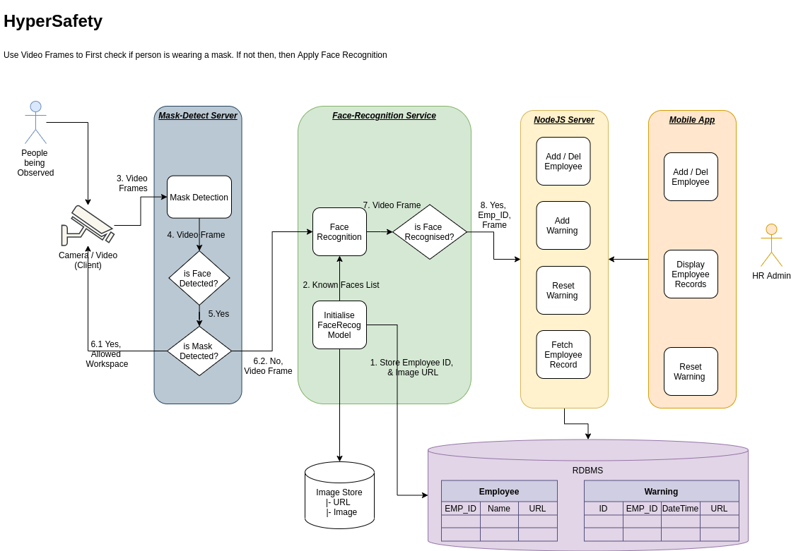

# HyperSafety ML Service
## Mask-Detection & Face-Recognition Service for Safety in Work Places.

The HyperSafety ML Service of the [HyperSafety Frontend](https://github.com/HarshAmbasta/HyperSafety_Frontend_Hack) and the [HyperSafety Backend](https://github.com/ViVek6301/HyperSafety_Backend_Hack), an Employee Management Project in which images and details of Employees can be uploaded, which would then be used to detect whether or not Employees are wearing a mask in the Workplace. The [HyperSafety Frontend](https://github.com/HarshAmbasta/HyperSafety_Frontend_Hack) can then be used by the Higher-ups to check which Employees have been caught without a mask.



# ⚠️ WARNING!

### One of the dependencies (dlib) is NOT COMPATIBLE with Windows! Hence the Project cannot be run on Windows!

# INSTALLATION

### Install Torch

    pip3 install torch torchvision torchaudio
    
### Install skvideo

    pip3 install sk-video
    
### Install sklearn

    pip3 install -U scikit-learn

### Install pandas

    pip3 install pandas
    
### Install opencv

    pip3 install opencv-python
    
### Install pytorch-lightning 

*(v1.2.10 IS RECOMMENDED)*
    
    pip3 install pytorch_lightning==1.2.10
    
### Install ffmpeg

    sudo apt install ffmpeg
    
## Dependencies for Face Recognition

### Install Cmake

    sudo apt install cmake

### Install dlib

```
git clone https://github.com/davisking/dlib.git
``` 
  
```   
cd dlib ; mkdir build ; cd build
```   
   
```   
cmake ..
```   
   
```   
sudo cmake --build . ; cd ..
```

```    
python3 setup.py install
```
   
### Install face recognition

    pip3 install face_recognition


Then, clone the Git Repository.

# Test our Project

## Navigate to the root directory of the project. 

## Run HyperSafety Server :

     python3 -W ignore -m HyperSafety.HyperSafety_Server

## Run HyperSafety Client :

    python3 -m HyperSafety.HyperSafety_Client
